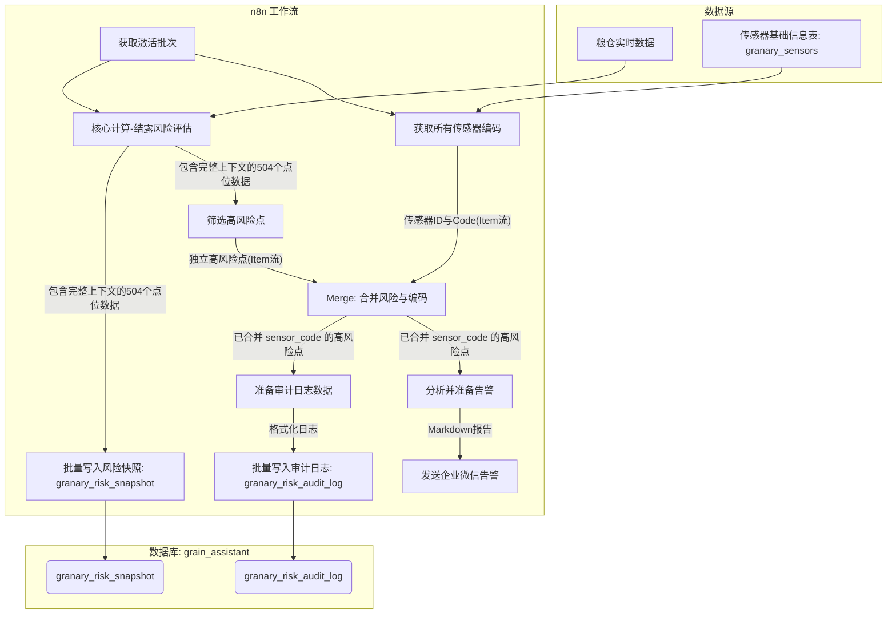

# Granary_Manage
大型粮仓监控系统
# **《大型粮仓结露预警系统 - V2.1开发总结报告》**

| **项目名称** | 大型粮仓结露预警系统 - 迭代V2.1 |
| :--- | :--- |
| **报告版本** | V1.0 |
| **编制日期** | 2025年9月26日 |
| **核心成员** | 王柳 |
| **存档格式** | Markdown |

---

## 1. 需求演进与核心要点

本次开发工作在已有的“轨道C：点位级梯度模型”基础上，围绕**提升系统告警能力、可信度与健壮性**展开，核心需求可归纳为三个阶段的演进：

### 1.1 前期基础 (本次对话前)
系统已具备三轨融合的风险计算核心能力，但处于“有数据，无洞察”的阶段。
- **已实现**：完成了轨道A（顶空温差）、轨道B（返潮校验）及轨道C（温度梯度）的核心算法开发。
- **已实现**：计算结果（包含`temp_grad_v`, `trackc_score`等梯度指标）已成功存入`granary_risk_snapshot`数据表。
- **痛点**：告警通路处于中断状态，且逻辑陈旧，无法解读和呈现最有价值的轨道C梯度风险。

### 1.2 阶段一：重构告警通路，实现多维洞察
- **需求要点**：修复并升级告警流程，使其能充分利用已有的三轨融合数据，为粮仓保管员提供一份**“看得懂、信得过、用得上”**的综合风险报告。
- **验收标准**：系统能通过企业微信，自动推送一份结构化的Markdown告警报告，报告需包含：
    1.  对轨道A、B、C的独立风险态势分析。
    2.  各轨道的Top 5高风险点位列表。
    3.  最终的综合风险评级。
    4.  明确的标准化操作程序（SOP）建议。

### 1.3 阶段二：建立可审计的计算日志，构建系统信任
- **需求要点**：为了让传统经验丰富的保管员完全信任系统的预警结果，必须将系统“黑盒”的计算过程，以他们熟悉的传统结露判断步骤**“翻译”并呈现**出来。
- **验收标准**：
    1.  为所有中高风险点位，自动生成一份详细的“计算履历”。
    2.  这份履历需包含**仓温、仓湿、点温、实际水汽压(Eₐ)、露点(T_d)、粮食平衡相对湿度(ERH)**等关键中间变量。
    3.  履历数据需持久化存入一个新的数据库表中，供随时查询、复核与导出。
    4.  数据写入必须是**幂等的**，重复运行工作流不应产生重复数据。

### 1.4 阶段三：增强数据可读性，打通人机交互
- **需求要点**：在所有输出（尤其是审计日志）中，使用人类可读的业务编码（如`1Q1-01-01`）替代机器ID（如`507`），消除理解障碍。
- **验收标准**：审计日志表中需包含`sensor_code`字段，并能被正确填充。

## 2. 技术选型与实现策略

### 2.1 技术栈
- **工作流引擎**: **n8n (Self Hosted v1.109.1)**，利用其可视化的流程编排与强大的Code节点（JavaScript）进行核心逻辑开发。
- **数据库**: **PostgreSQL**，用于存储风险快照与审计日志。
- **核心语言**: **JavaScript (Node.js)**，用于在n8n Code节点中实现复杂的科学计算、数据处理与报告生成。

### 2.2 需求拆解与实现策略
- **告警通路重构**:
    - **策略**：在n8n中，利用`Code`节点作为“报告生成引擎”。该节点负责从上游获取全量计算结果，在内存中进行复杂的多维度统计分析（分轨统计、排序、Top N筛选），最后利用JavaScript的模板字符串功能，动态生成结构化的Markdown文本。
- **审计日志建立**:
    - **架构决策**：在主工作流的计算核心后，创建一条**并行的“审计”支路**。这样做的好处是，日志记录的逻辑与主数据流、告警流完全解耦，互不影响。
    - **数据富化**：为解决`sensor_code`的填充问题，采用了**Merge节点**作为“数据富化”的关键。通过`Combine by Field`模式，将主数据流中的风险信息与从`granary_sensors`表中查出的编码信息，基于`sensor_id`进行高效、精准的合并。
    - **幂等性实现**：在两个`Postgres`写入节点中，均采用了`INSERT ... ON CONFLICT (unique_constraint) DO UPDATE ...`的**UPSERT** SQL语法。首先为目标表（`granary_risk_snapshot`和`granary_risk_audit_log`）的` (ts, sensor_id)` 字段组合创建了唯一约束，然后利用该约束作为冲突判断的依据，从而实现了完美的幂等性。
- **数据源完整性保障**：
    - **架构反思与最终方案**：在调试后期，我们发现所有问题的根源在于**数据在流转过程中的上下文丢失**。最终，我们采纳了最稳健的架构模式：**在数据产生的源头，就让每一条数据“生而完整”**。即，在“核心计算-结露风险评估”节点中，通过循环，将`t_head`等全局变量，附加到每一个点位的JSON对象上。这一决策，极大地简化了所有下游节点的逻辑，根除了所有因数据不完整导致的`[null]`问题。

## 3. 核心算法与计算公式

### 3.1 基础公式
- **饱和水汽压 ($E_s$)**:
  $$ E_s(T) = 6.1094 \times e^{\frac{17.625 \times T}{T + 243.04}} $$
  *   **解释**: 根据空气温度(T, ℃)计算该温度下空气能容纳的最大水汽压力(hPa)。

- **实际水汽压 ($E_a$)**:
  $$ E_a = E_s(T_{air}) \times \frac{RH_{air}}{100} $$
  *   **解释**: 根据仓内空气温度($T_{air}$)和相对湿度($RH_{air}$)计算空气中实际的水汽压力。

- **露点温度 ($T_d$)**:
  $$ T_d = \frac{243.04 \times \ln(\frac{E_a}{6.1094})}{17.625 - \ln(\frac{E_a}{6.1094})} $$
  *   **解释**: 空气冷却到水汽开始凝结的临界温度。

### 3.2 轨道A：顶空温差模型
- **核心公式**:
  $$ \Delta T = T_{surface} - T_d $$
  *   **解释**: 粮食表面温度($T_{surface}$)与仓内空气露点($T_d$)的差值。$\Delta T$越小，结露风险越高。

### 3.3 轨道B：粮食平衡相对湿度(ERH)校验
- **核心逻辑**: 判断粮食与空气的水汽交换趋势。
- **场景**: 若 `RH_air` (空气实际相对湿度) > `ERH` (粮食平衡相对湿度)，则粮食会吸湿，导致空气湿度下降，此过程为“返潮”。
- **作用**: 当`is_rewetting = true`时，对轨道A的风险等级进行`+1`加权，以体现返潮带来的额外风险。

### 3.4 轨道C：点位级温度梯度模型
#### 3.4.1 四大梯度指标
1.  **垂直温度梯度 ($G_v$)**:
    $$ G_v = T_{self} - T_{vertical\_neighbor} $$
    *   **解释**: 测量点($T_{self}$)与其垂直相邻点（优先上方，无则下方）的温差。反映热量垂直方向的异常流动。
    *   **边界处理**: 顶层点只与下方点比较，底层点只与上方点比较。

2.  **水平温度梯度 ($G_h$)**:
    $$ G_h = T_{self} - \text{avg}(T_{horizontal\_neighbors}) $$
    *   **解释**: 测量点与其同层环状相邻点的平均温差。反映热量在水平截面上的异常。
    *   **边界处理**: 若只有一个水平相邻点，则直接使用该点温度。

3.  **局部温度尖峰 ($S_{local}$)**:
    $$ S_{local} = T_{self} - \text{avg}(T_{all\_immediate\_neighbors}) $$
    *   **解释**: 测量点与其所有直接相邻点（垂直+水平）的平均温差。用于识别孤立的“热点”或“冷点”。

4.  **实时温度变化率 ($R_t$)**:
    $$ R_t = \frac{T_{self, current} - T_{self, past}}{\Delta t} $$
    *   **解释**: 测量点当前温度与数小时前温度的差值，反映温度的短期变化趋势。

#### 3.4.2 风险评分与定级
- **风险评分 ($Score_C$)**:
  $$ Score_C = w_v \cdot N(G_v) + w_h \cdot N(G_h) + w_s \cdot N(S_{local}) + w_r \cdot N(R_t) $$
  *   **解释**: 将四大梯度指标归一化($N()$)后，进行加权求和。
  *   **系数取法**: 根据专家经验设定，当前版本权重($w$)为：`垂直梯度(0.4)`, `水平梯度(0.2)`, `局部尖峰(0.3)`, `实时变化(0.1)`。

- **风险定级 ($Level_C$)**:
  *   **规则**: 基于$Score_C$的阈值进行划分。
  *   **阈值**:
    *   `Level 1 (低风险)`: $Score_C \in (0.3, 0.6]$
    *   `Level 2 (中风险)`: $Score_C \in (0.6, 0.8]$
    *   `Level 3 (高风险)`: $Score_C > 0.8$

## 4. 系统工作流设计 (最终版)

## 5. 开发成果与关键信息

| **类别** | **详情** |
| :--- | :--- |
| **软件名称** | n8n, PostgreSQL |
| **相关PRD文档** | 《大型粮仓结露预警系统 - 轨道C（点位级梯度模型）技术开发报告V2.md》, 《开发技术报告0914.md》, 《轨道C：温度梯度风险模型 — 设计文档（落地版）.md》 |
| **数据库名称** | `grain_assistant` |
| **涉及数据表** | **`granary_risk_snapshot` (修改)**: - `temp_grad_v` (real): 垂直温度梯度 - `temp_grad_h` (real): 水平温度梯度 - `temp_local_spike` (real): 局部温度尖峰 - `temp_trend_rt` (real): 实时温度变化率 - `trackc_score` (real): 轨道C风险分 - `trackc_level` (int): 轨道C风险等级  **`granary_risk_audit_log` (新建)**: - `id` (bigserial, PK): 主键 - `snapshot_ts` (timestamptz, NOT NULL): 快照时间戳 - `warehouse_id` (int, NOT NULL): 仓库ID - `sensor_id` (int, NOT NULL): 传感器ID - `sensor_code` (varchar): 传感器业务编码 (如'1Q1-01-01') - `t_head` (real): 仓内顶空温度 (T_air) - `rh_head` (real): 仓内顶空湿度 (RH_air) - `grain_temp` (real): 测温点粮食温度 (T_测) - `e_actual` (real): 仓内实际水汽压 (Eₐ) - `tdew_head` (real): 仓内空气露点温度 (T_d) - `erh` (real): 粮食平衡相对湿度 (ERH) - `risk_adjustment_reason` (text): 风险修正原因说明 (轨道B判断) - `risk_level_a` (smallint): 轨道A风险等级 - `is_rewetting` (boolean): 是否存在返潮 (轨道B判断) - `trackc_level` (smallint): 轨道C风险等级 - `final_risk_level` (smallint): 最终综合风险等级 |

## 6. 系统特色与亮点

1.  **多轨融合的立体式预警模型**:
    系统不仅依赖传统的表层温差（轨道A），更创新性地融入了深层的温度梯度变化（轨道C）作为核心判断依据，实现了从“点”到“体”，从“表层”到“内部”的立体式风险态势感知，能更早地发现潜在的结露风险。

2.  **可解释性AI (XAI) 在储粮领域的成功实践**:
    新建的“审计日志”功能，是本次开发的最大亮点。它成功地搭建了一座“信任的桥梁”，将复杂的机器学习模型（梯度分析）的输出，“翻译”回保管员熟悉的传统物理量（露点、水汽压等），实现了预警结果的**可追溯、可审计、可解释**，极大地提升了系统的接受度和权威性。

3.  **高度健壮与自愈的幂等性工作流**:
    通过在数据库层面建立唯一性约束，并结合SQL的`UPSERT`语法，确保了所有数据写入操作的幂等性。这意味着工作流可以安全地重复运行，不仅不会造成数据污染，还能在算法更新后，用新的、更准确的结果自动覆盖历史数据，实现了系统的**自我修正与数据净化**。

4.  **面向决策的行动导向型报告**:
    全新的企业微信告警，不再是冰冷的数字罗列。它是一份为管理者精心设计的“情报简报”，通过多维度分析、风险点高亮和明确的SOP建议，将原始数据转化为了**可直接执行的行动指令**，真正实现了从“数据监测”到“智能决策支持”的价值闭环。

5.  **以人为本的数据设计**:
    坚持在所有面向用户的输出（日志、报告）中使用人类可读的`sensor_code`，体现了“以人为本”的设计哲学，确保系统无论对机器还是对最终用户，都同样友好。

---
