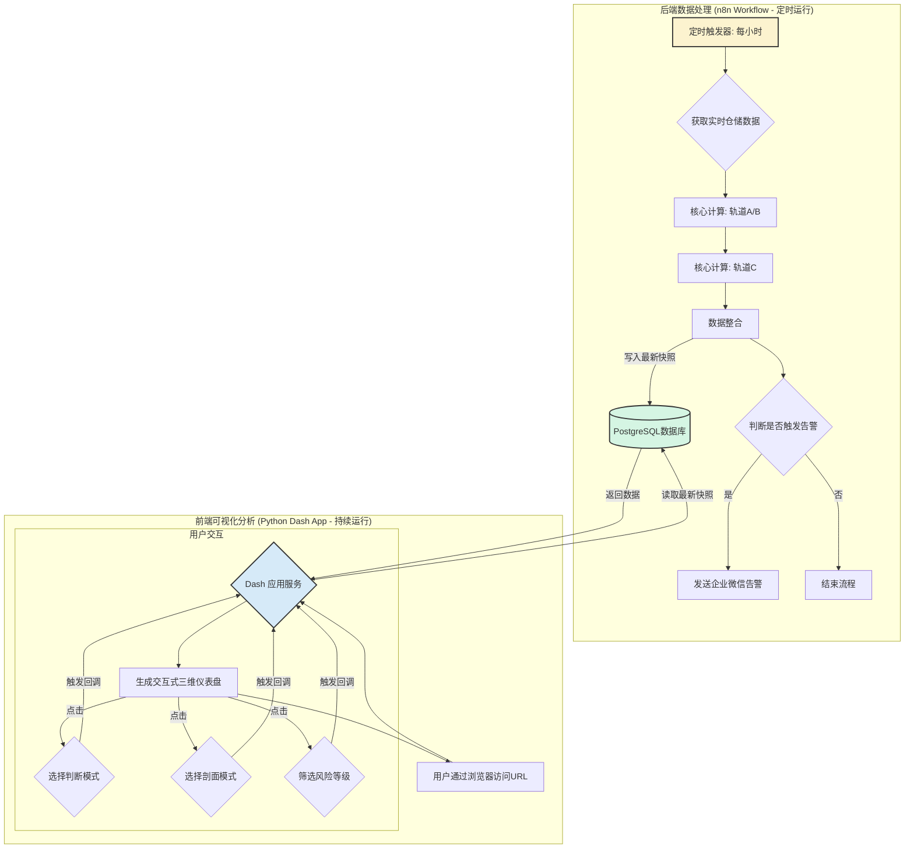

我将整个项目的合作过程和成果，梳理成一份完整的软件技术开发报告。这份报告将基于我们的全部对话内容，全面地反映项目的背景、设计、实现与成果。

---

## **大型粮仓结露预警与三维可视化分析系统 - 软件技术开发报告**

**版本：** 2.0  
**日期：** 2025年9月14日  
**报告人：Wangliu

### **1. 项目基本需求**

本项目旨在构建一个先进、智能的大型粮仓结露预警系统。系统通过多模型融合分析，结合交互式三维可视化技术，为粮库保管员提供从早期风险预警到直观态势感知的全方位决策支持。

#### **1.1 系统原有功能 (阶段 I)**

在本次升级前，系统已具备基于“双轨物理模型”的结露预警核心功能：

*   **轨道A (顶空锚定法)**：通过计算粮堆表面温度与粮仓顶空露点温度的差值 (`ΔT`)，直接判断表层结露的临界风险。
*   **轨道B (ERH校验)**：通过计算点位的估算空气相对湿度 (`RH_est`) 与当前温、水条件下粮食的平衡相对湿度 (`ERH`)，判断是否存在“返潮”风险，并对轨道A的风险等级进行加权。
*   **自动化工作流**：基于 n8n 平台，实现了从数据获取、风险计算、数据持久化到企业微信告警的自动化流程。
*   **数据存储**：使用 PostgreSQL 数据库，结合 TimescaleDB 和 PostGIS 扩展，高效存储时序和空间数据。

#### **1.2 本次任务完成的功能 (阶段 II)**

本次开发任务在原有系统基础上，进行了两大核心升级：

1.  **增加独立风险维度**：引入并实现了**轨道C (温度梯度风险模型)**。通过分析粮堆内部的垂直、水平、局部及时间维度的温度梯度，捕捉由水汽迁移引发的早期、深层风险信号，并将其与原有风险等级进行融合，提升了预警的灵敏度和前瞻性。
2.  **开发交互式三维可视化仪表盘**：开发了一个基于 Python 和 Plotly Dash 的独立Web应用。该应用能够：
    *   以三维形式真实还原粮仓内所有测温点的空间分布。
    *   提供交互式菜单，允许用户在轨道A、轨道B、轨道C及综合判断四种风险模型的视图间自由切换。
    *   提供可点选的图例，允许用户按风险等级（红、橙、黄、绿）对点位进行动态筛选和聚焦。
    *   实现创新的三维剖面分析功能，用户可通过点击图中任意点，实时高亮显示其所在的横剖面、纵剖面或环剖面，深入洞察风险的空间分布规律。
    *   在图形中直观展示电缆编号，并通过鼠标悬停显示每个测温点的详细编号信息（电缆号、层数）。

#### **1.3 项目采用的计算理论及公式**

*   **轨道A (顶空锚定法)**
    *   **理论**：当粮堆表面温度 (`T_surface`) 低于或接近其上方空气的露点温度 (`T_dew`) 时，空气中的水汽会凝结成液态水，形成结露。
    *   **核心公式**：`ΔT = T_surface - T_dew`
    *   **风险分级**：`ΔT ≤ 1℃` (3级-高风险), `1℃ < ΔT ≤ 2℃` (2级-中风险), `2℃ < ΔT ≤ 3℃` (1级-低风险)。
    *   **露点计算**：采用 Magnus-Tetens 公式估算饱和水汽压 `es(T)`，进而计算露点。
        `es(T) = 6.1094 * exp((17.625 * T) / (T + 243.04))`

*   **轨道B (ERH 校验)**
    *   **理论**：粮食是吸湿性材料，其水分会与周围空气湿度达到平衡。当环境估算相对湿度 (`RH_est`) 持续高于粮食的平衡相对湿度 (`ERH`) 时，粮食会吸湿返潮，增加霉变和结露的潜在风险。
    *   **核心公式**：`风险加权 if RH_est > ERH`
    *   **ERH 计算**：采用修正的 Henderson-Thompson 方程。
        `ERH = 1 - exp(-A * (T + C) * M^B)` (其中A, B, C为粮食品种相关系数)

*   **轨道C (温度梯度风险模型)**
*    **说明**： 此部分工作的最终实现请参见文档 《大型粮仓结露预警智能系统 - 轨道C（点位级梯度模型）专项技术开发总结报告》
    *   **理论**：在封闭的粮堆中，温度梯度是驱动内部水汽迁移的主要动力。水汽会从高温区向低温区迁移、聚集，在局部冷点形成高湿甚至结露的风险。
    *   **核心指标**：
        1.  **垂直温度梯度 (G_v)**: `(T_top - T_bottom) / Height`
        2.  **水平温差 (ΔT_h)**: `T_wall_avg - T_center_avg`
        3.  **局部梯度峰值 (S_local)**: `max(|T_i - T_j| / distance_ij)`
        4.  **短期温变率 (R_t)**: `(T_now - T_past) / Δtime`
    *   **风险因子合成**：通过对各指标进行归一化 `N()` 和加权 `w` 计算得出。
        `F_c = w_v*N(G_v) + w_h*N(ΔT_h) + w_s*N(S_local) + w_r*N(R_t)`
##### **说明**： 轨道C的最终实现以 《大型粮仓结露预警智能系统 - 轨道C（点位级梯度模型）专项技术开发总结报告》为准
### **2. 设计架构与技术栈**

本项目采用“**数据处理与可视化展示分离**”的现代架构，确保系统各部分的独立、健壮与可扩展性。

*   **架构描述**：
    1.  **后端数据处理层 (n8n)**：作为自动化引擎，负责定时执行数据采集、多模型风险计算、结果持久化和消息告警的完整ETL流程。
    2.  **数据中心 (PostgreSQL)**：作为系统的核心数据枢纽，存储所有静态配置数据、原始时序数据以及计算后的风险快照数据，是前后端解耦的桥梁。
    3.  **前端可视化层 (Python Dash App)**：作为一个独立的、长期运行的Web服务，负责从数据库中读取最新的风险数据，并为最终用户提供一个高度交互式、功能丰富的Web仪表盘界面。

*   **技术栈**：
    *   **工作流自动化**：`n8n`
    *   **数据库**：`PostgreSQL` (v12+)
        *   **时序数据扩展**：`TimescaleDB`
        *   **地理空间扩展**：`PostGIS`
    *   **可视化应用框架**：`Python` (v3.10+)
        *   **Web框架**：`Plotly Dash`
        *   **核心库**：`Pandas` (数据处理), `NumPy` (科学计算), `psycopg2` (数据库连接), `Plotly` (图形引擎)

### **3. 数据库设计**

数据库设计遵循第三范式，对静态配置数据、动态时序数据和计算结果数据进行分离存储，以优化查询性能和维护性。

*   **`warehouses`, `granary_batches`**：存储粮仓和批次的静态信息。
*   **`granary_sensors`**：核心配置表，存储每个传感器的唯一标识、业务编码 (`code`) 和至关重要的三维空间坐标 (`loc`, PostGIS Point类型)。
*   **`granary_measurements`**：核心时序数据表，通过 TimescaleDB 进行超表（Hypertable）转换，专门用于高效存储和查询海量的传感器测量数据。
*   **`granary_risk_snapshot`**：核心结果表，存储每一轮计算后，每个传感器的详细风险快照，包括各轨道模型的关键指标和最终风险等级。此表是可视化应用的主要数据源。

### **4. 数据库结构对照表**

此表整合了项目原有（阶段 I）及本次新增（阶段 II）后的完整数据库结构。

| 表名 (Table Name)             | 字段名 (Field Name)         | 中文解释               | 数据类型 (Type)                | 索引/约束 (Index/Constraint)                   |
| ----------------------------- | --------------------------- | ---------------------- | ------------------------------ | ---------------------------------------------- |
| **warehouses**                | id                          | 粮仓ID                 | integer                        | Primary Key                                    |
|                               | name                        | 粮仓名称               | character varying(255)         | Unique                                         |
|                               | capacity                    | 设计仓容 (吨)          | integer                        |                                                |
|                               | geom                        | 粮仓几何参数           | jsonb                          |                                                |
| **granary_batches**           | id                          | 批次ID                 | integer                        | Primary Key                                    |
|                               | warehouse_id                | 所属粮仓ID             | integer                        | Foreign Key -> warehouses(id)                  |
|                               | batch_name                  | 批次名称               | character varying(255)         |                                                |
|                               | grain_type                  | 粮食品种               | character varying(50)          |                                                |
|                               | initial_moisture_content    | 初始水分含量 (%)       | double precision               |                                                |
|                               | storage_start_date          | 入库开始日期           | timestamp with time zone       |                                                |
|                               | is_active                   | 是否为当前活动批次     | boolean                        |                                                |
| **granary_sensors**           | id                          | 传感器ID               | integer                        | Primary Key                                    |
|                               | warehouse_id                | 所属粮仓ID             | integer                        | Foreign Key -> warehouses(id)                  |
|                               | code                        | 传感器业务编码         | character varying(255)         | Unique                                         |
|                               | kind                        | 传感器类型             | character varying(50)          | e.g., 'grain_temp', 'headspace'                |
|                               | loc                         | **空间三维坐标**       | geometry(PointZ, 4326)         | **PostGIS Spatial Index**                      |
| **granary_measurements**      | time                        | **测量时间**           | timestamp with time zone       | **TimescaleDB Hypertable (time)**, Primary Key |
|                               | sensor_id                   | 传感器ID               | integer                        | Foreign Key -> granary_sensors(id), Primary Key |
|                               | temperature                 | 温度 (°C)              | double precision               |                                                |
|                               | humidity                    | 湿度 (%)               | double precision               |                                                |
| **granary_risk_snapshot**     | ts                          | 快照时间戳             | timestamp with time zone       | Primary Key                                    |
|                               | sensor_id                   | 传感器ID               | integer                        | Foreign Key -> granary_sensors(id), Primary Key |
|                               | t                           | 粮温 (°C)              | double precision               |                                                |
|                               | rh_est                      | 估算相对湿度 (%)       | double precision               |                                                |
|                               | t_dew                       | 露点温度 (°C)          | double precision               |                                                |
|                               | delta_t                     | **ΔT (轨道A核心)**     | double precision               |                                                |
|                               | risk_level                  | **综合风险等级**       | smallint                       | Index                                          |
|                               | track                       | 风险判定轨道           | character varying(10)          | 'A', 'A+B'                                     |
|                               | details                     | 详细计算信息 (JSON)    | jsonb                          |                                                |
|                               | **temp_grad_v**             | **垂直温度梯度 (C)**   | double precision               | *阶段II新增*                                   |
|                               | **temp_grad_h**             | **水平温差 (C)**       | double precision               | *阶段II新增*                                   |
|                               | **temp_local_spike**        | **局部梯度峰值 (C)**   | double precision               | *阶段II新增*                                   |
|                               | **temp_trend_rt**           | **短期温变率 (C)**     | double precision               | *阶段II新增*                                   |
|                               | **trackC_score**            | **轨道C风险因子 (C)**  | double precision               | *阶段II新增*                                   |
|                               | **trackC_level**            | **轨道C风险等级 (C)**  | smallint                       | *阶段II新增*, Index                            |

### **5. 项目软件流程图 (Mermaid 格式)**

